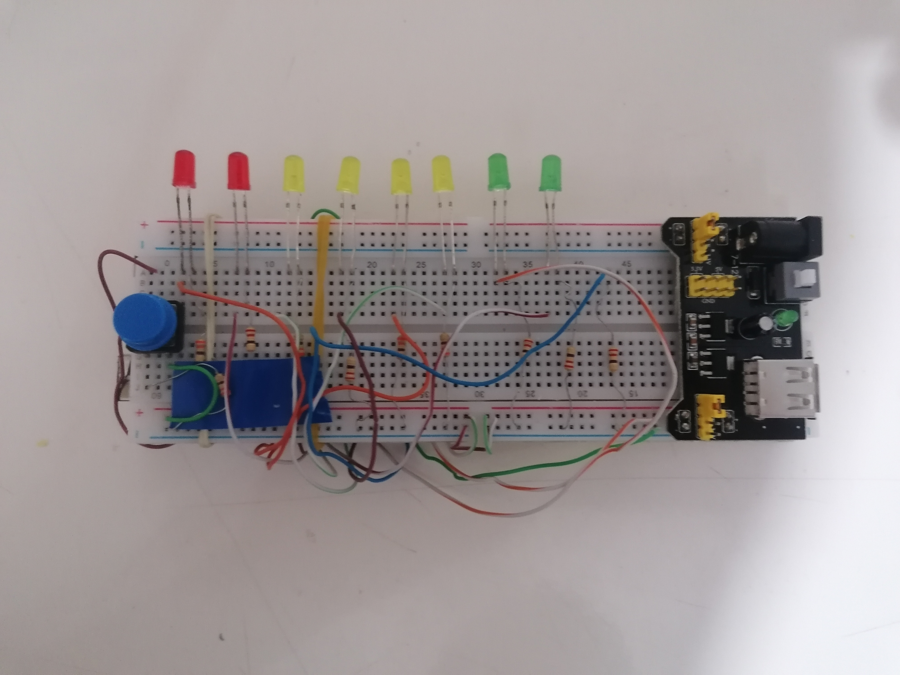

\# Color\_Match 🎯


An Arduino LED reaction game where the player tries to catch a moving LED by pressing a button at the correct moment.


The game starts with one target LED turned on. After pressing the button, the LEDs begin to chase forward and backward like a moving light. The player's goal is to press the button when the moving LED reaches the target LED.


Each successful round increases the difficulty by making the LED movement faster. When the maximum speed is reached, the game resets back to the starting difficulty.


\---


\## 🎮 How It Works


1\. The game waits for the player to press the button.

2\. A random target LED lights up.

3\. The player presses the button to start the round.

4\. The LEDs start moving back and forth.

5\. Press the button when the moving LED matches the target LED:


&#x20;  \* ✅ Correct timing: You win.

&#x20;  \* ❌ Wrong timing: You lose.

6\. The result LED(s) blink to show the result.

7\. Every win makes the game faster and harder.


\---


\## 🧰 Components Used


\* Arduino board (Arduino Uno recommended)

\* 8x LEDs

\* 8x 220Ω resistors

\* Push button

\* Breadboard

\* Jumper wires

\* Breadboard power supply module

\* USB cable for programming


\---


\## 🔌 Wiring Diagram


\### LED Connections


Each LED is connected to an Arduino digital pin through a 220Ω resistor.


| LED   | Arduino Pin | Resistor |

| ----- | ----------- | -------- |

| LED 1 | D2          | 220Ω     |

| LED 2 | D3          | 220Ω     |

| LED 3 | D4          | 220Ω     |

| LED 4 | D5          | 220Ω     |

| LED 5 | D6          | 220Ω     |

| LED 6 | D7          | 220Ω     |

| LED 7 | D8          | 220Ω     |

| LED 8 | D9          | 220Ω     |


\### LED Pin Setup


```

LED Anode (+)  → 220Ω resistor → Arduino digital pin

LED Cathode (-) → GND rail

```


\---


\## 🔘 Button Connection


The button is connected using an external pull-down resistor.


| Button Pin    | Connection                    |

| ------------- | ----------------------------- |

| One side      | Arduino 5V                    |

| Other side    | Arduino D13                   |

| Same D13 side | 10kΩ pull-down resistor → GND |


Button logic:


```

Pressed  = HIGH

Released = LOW

```


\---


\## ⚡ Power Connections


Breadboard power rails:


| Breadboard | Connection                              |

| ---------- | --------------------------------------- |

| + Rail     | Arduino 5V / Breadboard power supply +  |

| - Rail     | Arduino GND / Breadboard power supply - |


All LED cathodes and button ground connections share the same GND line.


\---


\## 📁 Project Structure


```

Color\_Match/

│

├── Color\_Match.ino

├── LICENSE

└── README.md

```


\---


\## 🚀 Features


\* Random target LED selection

\* Moving LED chase animation

\* Reaction-based gameplay

\* Increasing difficulty system

\* Win/loss feedback animation

\* Button debounce protection

\* MIT Licensed


\---


\## 🛠 Future Improvements


Possible upgrades:


\* Add a score counter

\* Add a buzzer for sound effects

\* Add an OLED display

\* Add multiple difficulty modes

\* Add RGB LEDs

\* Add saved high score using EEPROM


\---


\## 📜 License


This project is licensed under the MIT License.


You are free to use, modify, and distribute this project with proper attribution.


---

## 📸 Project Preview



## 🎥 Demo Video

[Watch the gameplay demo](video/demo.mp4)


